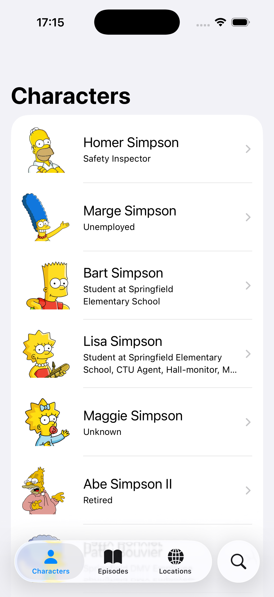
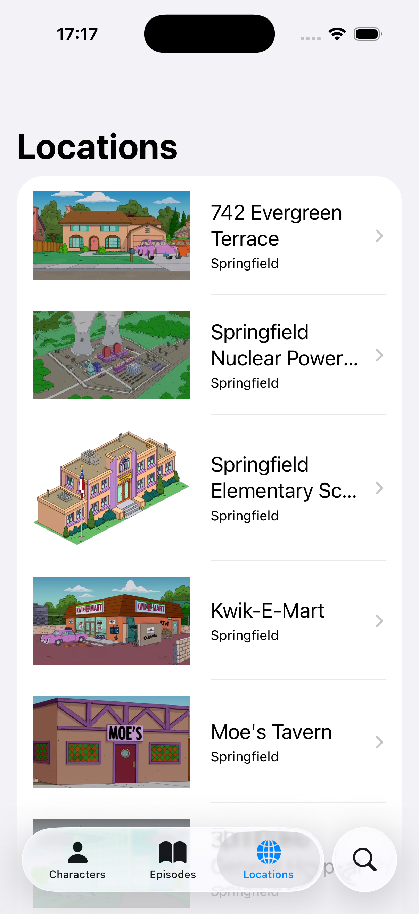
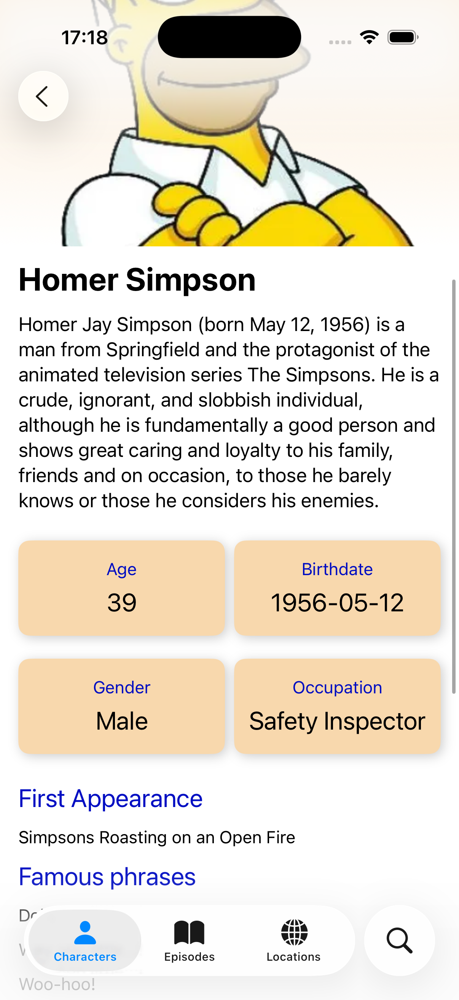
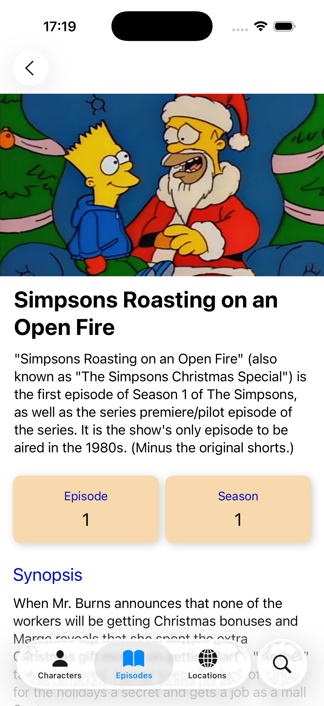
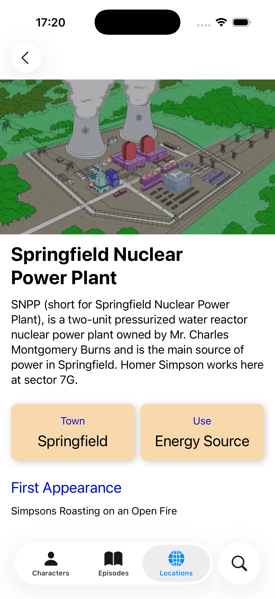

# TheSimpsonsBookApp

Aplicación iOS desarrollada con Swift, SwiftUI y arquitectura MVVM que muestra información de la serie Los Simpson: personajes, episodios y localizaciones. Incluye listado con detalle individual y paginación. Implementa Swift Concurrency (async/await) y un patrón de Interactor/Repository para el acceso a datos.
 
 ## Tabla de contenidos
 
1. [Características principales](#Características-principales)
2. [Capturas](#Capturas)
3. [Tecnologías](#Tecnologías)
4. [Arquitectura](#Arquitectura)
5. [Instalación](#Instalación)
6. [Autor](#autor)

## Características principales

- Listado de:
  - Personajes
  - Episodios
  - Localizaciones
- Detalle de cada elemento:
  - Personaje: Imagen, nombre e información, primer episodio en el que aparece y sus frases mas famosas
  - Episodio: Imagen, nombre e información y sinopsis
  - Localización: Imagen, nombre e información y primer episodio en el que aparece
- Paginación con carga incremental (infinite scroll)
- Gestión de estado de la vista (loading, finished, error)
- Manejo de errores con mensajes de usuario
- UI basada en SwiftUI con TabBar para navegación principal

## Capturas

| Lista de personajes | Lista de episodios | Lista de localizaciones |
| ----------- | ------------ | ------------ | 
|  |  |  |

| Detalle de personaje | Detalle de personaje | Detalle del episodio |
| ----------- | ------------ | ------------ |
|  |  |  | 

## Tecnologías

- Swift 6
- SwiftUI
- Xcode 26.0.1
- Async/Await, Sendable, MainActor (Swift Concurrency)

## Arquitectura

- MVVM (Model-View-ViewModel)
- Interactor + Repository para capa de datos
- DTO -> BO (Business Object) con mapeos explícitos
- Swift Concurrency (async/await) para peticiones asíncronas
- Gestión de estados con `enum ViewState` (loading, finished, error)
- Paginación con URL “next” 

## Requisitos

- iOS 18.0 o superior
- Xcode 16.0 o superior

## Instalación

1. Clona el repositorio:
   git clone https://github.com/Andresalnz/TheSimpsonsBook.git
2. Abre el proyecto en Xcode 16+.
3. Selecciona el esquema “TheSimpsonsBookApp”.
4. Ejecuta la app en un simulador o dispositivo con iOS 18+.

## Autor

**Andres Aleu :v:** 

andresaleunz@gmail.com

[Linkedin](https://www.linkedin.com/in/andres-aleu-nu%C3%B1ez-/)

